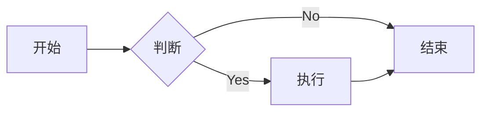
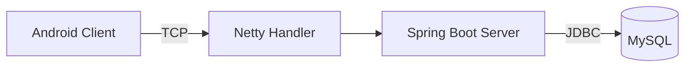

# Figma MCP 使用指南

> 本指南介绍如何在 Claude Code 中使用 Figma MCP 服务器进行设计开发协作

---

## 目录

1. [什么是 Figma MCP](#1-什么是-figma-mcp)
2. [核心功能概览](#2-核心功能概览)
3. [使用前准备](#3-使用前准备)
4. [常用功能详解](#4-常用功能详解)
5. [实战示例](#5-实战示例)
6. [最佳实践](#6-最佳实践)
7. [常见问题](#7-常见问题)

---

## 1. 什么是 Figma MCP

**Figma MCP** 是一个 Model Context Protocol (MCP) 服务器，让 Claude Code 能够直接与 Figma 设计文件交互，实现以下能力：

- 📊 **读取设计稿** - 获取 Figma 设计的详细信息
- 🎨 **生成 UI 代码** - 将设计转换为前端代码
- 📐 **生成图表** - 在 FigJam 中创建流程图、架构图等
- 🔗 **代码映射** - 建立 Figma 节点与代码组件的关联
- 🖼️ **导出截图** - 获取设计稿的实时截图

---

## 2. 核心功能概览

### 2.1 设计稿交互

| 功能          | 工具名称                 | 用途            |
| ----------- | -------------------- | ------------- |
| **获取设计上下文** | `get_design_context` | 生成 UI 代码、设计规范 |
| **获取元数据**   | `get_metadata`       | 获取设计结构概览      |
| **获取截图**    | `get_screenshot`     | 导出设计稿截图       |
| **获取变量**    | `get_variable_defs`  | 获取设计系统变量      |

### 2.2 FigJam 交互

| 功能               | 工具名称               | 用途             |
| ---------------- | ------------------ | -------------- |
| **获取 FigJam 内容** | `get_figjam`       | 读取 FigJam 白板内容 |
| **生成图表**         | `generate_diagram` | 创建流程图、状态图、甘特图  |

### 2.3 Code Connect (代码映射)

| 功能         | 工具名称                           | 用途             |
| ---------- | ------------------------------ | -------------- |
| **添加代码映射** | `add_code_connect_map`         | 关联 Figma 节点到代码 |
| **获取映射**   | `get_code_connect_map`         | 查看已有映射关系       |
| **获取映射建议** | `get_code_connect_suggestions` | 智能映射建议         |
| **发送映射**   | `send_code_connect_mappings`   | 批量创建映射         |

---

## 3. 使用前准备

### 3.1 认证 Figma 账号

在使用前需要先认证：

```
/mcp
```

成功后会显示：

```
Authentication successful. Connected to figma.
```

### 3.2 获取 Figma 文件信息

从 Figma 文件 URL 中提取关键参数：

**URL 格式**:

```
https://figma.com/design/{fileKey}/{fileName}?node-id={int1}-{int2}
```

**提取示例**:

- `fileKey`: URL 中的 `{fileKey}` 部分
- `nodeId`: `{int1}-{int2}` 转换为 `{int1}:{int2}`

**示例 URL**:

```
https://figma.com/design/pqrs/ExampleFile?node-id=1-2
```

- `fileKey` = `pqrs`
- `nodeId` = `1:2`

---

## 4. 常用功能详解

### 4.1 生成 UI 代码

**工具**: `get_design_context`

**用途**: 从 Figma 设计稿生成前端代码（React, Vue, HTML/CSS 等）

**参数**:

- `fileKey` (必需): Figma 文件 Key
- `nodeId` (必需): 节点 ID
- `clientLanguages`: 编程语言列表，如 `typescript,javascript`
- `clientFrameworks`: 框架列表，如 `react,vue`
- `forceCode`: 强制返回代码（即使输出过大）
- `disableCodeConnect`: 禁用 Code Connect

**示例**:

```
请帮我生成这个设计的 React 代码：
https://figma.com/design/abc123/HomePage?node-id=10-20
```

### 4.2 生成设计规范文档

**工具**: `get_design_context` + 输出类型 `spec`

**用途**: 提取颜色、字体、间距等设计规范

**示例**:

```
分析这个设计稿的设计规范，包括颜色、字体、间距等
```

### 4.3 生成流程图/架构图

**工具**: `generate_diagram`

支持类型:

- `graph` / `flowchart` - 流程图
- `sequenceDiagram` - 时序图
- `stateDiagram` / `stateDiagram-v2` - 状态图
- `gantt` - 甘特图

**Mermaid 语法示例**:



**示例**:

```
创建一个用户登录流程图
```

### 4.4 导出设计截图

**工具**: `get_screenshot`

**参数**:

- `fileKey` (必需): Figma 文件 Key
- `nodeId` (必需): 节点 ID

**示例**:

```
导出这个设计的截图：
https://figma.com/design/abc123/Button?node-id=5-10
```

### 4.5 获取设计结构概览

**工具**: `get_metadata`

**用途**: 快速查看设计的层级结构和节点类型

**返回格式**: XML 格式的节点树

**示例**:

```
查看这个设计的结构：
https://figma.com/design/abc123/HomePage
```

---

## 5. 实战示例

### 5.1 从设计稿生成 React 组件

**场景**: 设计师在 Figma 中完成了一个按钮组件设计

**操作步骤**:

1. **获取设计 URL**
   
   ```
   https://figma.com/design/abc123/ButtonDesign?node-id=15-25
   ```

2. **向 Claude 请求**
   
   ```
   请将这个按钮设计转换为 React + Tailwind CSS 代码
   ```

3. **Claude 会自动**:
   
   - 提取 `fileKey` = `abc123`
   - 提取 `nodeId` = `15:25`
   - 调用 `get_design_context` 获取设计
   - 生成对应的 React 代码

**生成结果示例**:

```tsx
import React from 'react';

interface ButtonProps {
  label: string;
  variant?: 'primary' | 'secondary';
  onClick?: () => void;
}

export const Button: React.FC<ButtonProps> = ({
  label,
  variant = 'primary',
  onClick
}) => {
  const baseClasses = 'px-4 py-2 rounded-lg font-medium';
  const variantClasses = variant === 'primary'
    ? 'bg-blue-600 text-white'
    : 'bg-gray-200 text-gray-800';

  return (
    <button
      className={`${baseClasses} ${variantClasses}`}
      onClick={onClick}
    >
      {label}
    </button>
  );
};
```

### 5.2 创建系统架构图

**场景**: 需要为项目创建一个架构文档中的流程图

**操作步骤**:

1. **向 Claude 描述需求**
   
   ```
   创建一个飞机大战游戏的系统架构流程图，包括：
   - 客户端 (Android)
   - 服务端 (Spring Boot + Netty)
   - 数据库 (MySQL)
   - 通信协议 (TCP + Protobuf)
   ```

2. **Claude 会自动**:
   
   - 分析系统结构
   - 生成 Mermaid 代码
   - 调用 `generate_diagram` 创建图表
   - 返回可编辑的 FigJam 链接

**生成的 Mermaid 代码**:



### 5.3 分析设计并生成 AI 提示词

**场景**: 想要复用某个设计，但让 AI 根据需求调整

**操作步骤**:

1. **提供设计 URL 和需求**
   
   ```
   分析这个设计，并生成一个提示词，让我能在保持风格的基础上改为暗色主题
   ```

2. **Claude 会**:
   
   - 分析设计的布局、色彩、组件
   - 生成详细的 AI 提示词（prompt）
   - 可用于其他 AI 工具（如 v0.dev）

### 5.4 建立 Code Connect 映射

**场景**: 项目使用 React，希望建立 Figma 设计与代码组件的关联

**操作步骤**:

1. **获取映射建议**
   
   ```
   https://figma.com/design/abc123/DesignSystem?node-id=50-60
   
   为我的 React 项目分析这个设计系统，建议如何映射到代码组件
   ```

2. **创建映射**
   
   ```
   将 Figma 中的 Button 节点映射到 src/components/Button.tsx
   ```

3. **查看已有映射**
   
   ```
   查看这个设计节点的代码映射关系
   ```

---

## 6. 最佳实践

### 6.1 工作流建议

**设计到代码流程**:

```
1. 设计师在 Figma 完成设计
2. 复制 Figma URL
3. 在 Claude Code 中请求生成代码
4. Claude 获取设计并生成代码
5. 复制生成的代码到项目中
6. 创建 Code Connect 映射（保持同步）
```

**文档图表流程**:

```
1. 在 Claude Code 中描述需要绘制的图表
2. Claude 生成 Mermaid 代码
3. 在 FigJam 中创建可编辑的图表
4. 复制 FigJam 链接到文档
```

### 6.2 命名规范

**描述设计时**:

- ✅ "主页登录区域的设计"
- ✅ "用户个人中心卡片组件"
- ❌ "这个设计"（过于模糊）

**描述图表时**:

- ✅ "创建用户注册流程的时序图"
- ✅ "绘制系统架构的状态图"
- ❌ "画个图"（缺少类型和上下文）

### 6.3 技术栈指定

**获取代码时明确技术栈**:

```
生成 Vue 3 + TypeScript + Tailwind CSS 代码
```

**支持的框架**:

- 前端: React, Vue, Svelte, Angular, Web Components
- 移动端: SwiftUI, Compose, Flutter, React Native
- 其他: Markdown, Storybook

### 6.4 版本控制

**重要提示**:

- Figma 设计可能随时更新
- 建议在注释中记录来源 URL
- 定期检查设计与代码的一致性

**示例**:

```tsx
/**
 * Button Component
 *
 * Source: https://figma.com/design/abc123/Button?node-id=15-25
 * Last synced: 2025-02-13
 */
```

---

## 7. 常见问题

### Q1: 如何从 URL 提取 fileKey 和 nodeId?

**A**: URL 格式为 `https://figma.com/design/{fileKey}/{fileName}?node-id={num1}-{num2}`

- `fileKey`: 第一个路径段
- `nodeId`: 将 `{num1}-{num2}` 改为 `{num1}:{num2}`

**示例**:

- URL: `https://figma.com/design/pqrs/File?node-id=1-2`
- `fileKey`: `pqrs`
- `nodeId`: `1:2`

### Q2: 生成的代码需要手动调整吗?

**A**: 通常需要微调：

- 响应式设计（断点）
- 事件处理函数
- 状态管理逻辑
- API 调用集成

### Q3: FigJam 图表可以编辑吗?

**A**: 可以！生成的图表是可编辑的 FigJam 文件，可以：

- 调整布局
- 修改样式
- 添加注释
- 邀请协作

### Q4: Code Connect 有什么用?

**A**: 建立设计与代码的双向关联：

- 设计师更新设计时，开发者能知道哪些代码需要更新
- 开发者修改代码时，能找到对应的设计节点
- 团队协作时保持设计与代码同步

### Q5: 如何处理大型设计文件?

**A**:

- 使用 `get_metadata` 先查看结构
- 针对特定节点使用 `get_design_context`
- 设置 `forceCode=true` 强制返回代码
- 分模块处理，避免一次性加载过大

### Q6: 支持哪些 Figma 文件类型?

**A**:

- ✅ 设计文件 (`.fig`)
- ✅ FigJam 白板 (需要使用 `get_figjam` 工具)
- ❌ Dev Mode 预览（使用标准设计文件工具）

---

## 附录: 工具快速参考

### A.1 设计稿相关

| 工具                   | fileKey | nodeId | 用途      |
| -------------------- | ------- | ------ | ------- |
| `get_design_context` | ✅       | ✅      | 生成代码/规范 |
| `get_metadata`       | ✅       | ✅      | 获取结构    |
| `get_screenshot`     | ✅       | ✅      | 导出截图    |
| `get_variable_defs`  | ✅       | ✅      | 获取变量    |

### A.2 FigJam 相关

| 工具                 | fileKey | nodeId | 用途   |
| ------------------ | ------- | ------ | ---- |
| `get_figjam`       | ✅       | ✅      | 读取白板 |
| `generate_diagram` | ❌       | ❌      | 创建图表 |

### A.3 Code Connect 相关

| 工具                             | fileKey | nodeId | 其他参数                  |
| ------------------------------ | ------- | ------ | --------------------- |
| `add_code_connect_map`         | ✅       | ✅      | source, componentName |
| `get_code_connect_map`         | ✅       | ✅      | codeConnectLabel      |
| `get_code_connect_suggestions` | ✅       | ✅      | -                     |
| `send_code_connect_mappings`   | ✅       | ✅      | mappings[]            |

### A.4 账号相关

| 工具       | 参数  | 用途     |
| -------- | --- | ------ |
| `whoami` | 无   | 查看认证用户 |

---

## 更新日志

- **2025-02-13**: 初始版本，支持设计稿读取、代码生成、图表创建

---

## 相关资源

- [Figma 官方文档](https://help.figma.com/)
- [Mermaid 图表语法](https://mermaid.js.org/)
- [Claude Code 文档](https://github.com/anthropics/claude-code)
